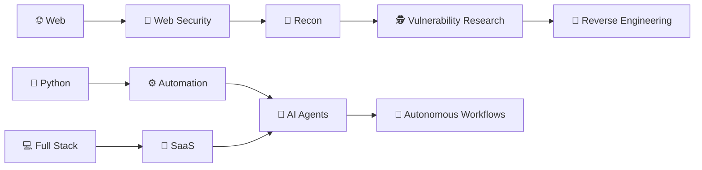

# 👋 Hey, I'm Kartikeyan Dubey

### `Cybersecurity × Automation × Full-Stack`

<p align="center">
  
</p>

<p align="center">
  <a href="https://github.com/kartikeyan-sudo">
    
  </a>
  <a href="https://github.com/kartikeyan-sudo?tab=followers">
    
  </a>
</p>

---

## 🧠 About Me

I'm a **B.Tech CSE student** who enjoys breaking things, understanding how they work, and then building better things.

My current interests sit at the intersection of:

```text
┌──────────────────────────────────────────────────────┐
│                                                      │
│   🔐 Cybersecurity        🤖 AI & Automation          │
│                                                      │
│   🕵️ Reconnaissance       ⚙️ n8n Workflows            │
│                                                      │
│   🏴 CTFs                 💻 Full-Stack Development   │
│                                                      │
│   🔬 Reverse Engineering  🌐 Web Security             │
│                                                      │
└──────────────────────────────────────────────────────┘
```

### 🔭 Currently Building

* 🤖 **AI-powered automation workflows**
* ⚡ **n8n agentic workflows & automations**
* 🔍 Security tools and reconnaissance experiments
* 🌐 Full-stack web applications
* 🧪 CTF labs and security research projects

### 🌱 Currently Learning

* 🔎 Advanced Reconnaissance
* 🔬 Reverse Engineering
* 🌐 Web Application Security
* 🛡️ SOC & Detection Engineering
* 🧠 AI Agents & LLM-powered automation

### 🏴 CTFs

I enjoy solving challenges involving:

`Web` • `OSINT` • `Cryptography` • `Steganography` • `Forensics` • `Linux` • `Reverse Engineering`

> **Break → Understand → Exploit → Learn → Build**

---

## ⚡ What I Like Doing

```text
$ whoami

kartikeyan@github
────────────────────────────

[+] Build automation
[+] Hunt vulnerabilities
[+] Solve CTF challenges
[+] Reverse engineer things
[+] Build web applications
[+] Experiment with AI agents
[+] Learn something new every day
```

I don't just want to learn tools.

**I want to understand what happens underneath them.**

---

## 🛠️ Tech Stack

### 👨‍💻 Languages

<p>

</p>

### 🌐 Web & Development

<p>

</p>

### 🔐 Cybersecurity

<p>

</p>

`Nmap` • `Burp Suite` • `Wireshark` • `ffuf` • `Gobuster` • `Feroxbuster`
`SQLMap` • `John the Ripper` • `Binwalk` • `Steghide` • `ExifTool`

### 🤖 AI & Automation

<p>

</p>

`n8n` • `AI Agents` • `LLM APIs` • `Workflow Automation` • `Prompt Engineering`

### ☁️ Deployment & Tools

<p>

</p>

---

# 🚀 Things I'm Working On

| Project            | What I'm Building                          |
| ------------------ | ------------------------------------------ |
| 🤖 AI Automation   | AI-powered workflows and autonomous agents |
| 🔍 SEO Auditor     | Automated website analysis using AI        |
| 🛡️ Security Labs  | Web security & reconnaissance experiments  |
| 🌐 Full-Stack Apps | Modern web applications & SaaS ideas       |
| 🏴 CTF Projects    | Security challenges, writeups & tooling    |

---

# 🧩 My Current Learning Path



---

# 🏴‍☠️ CTF & Security

<p align="center">


</p>

### 🔎 Areas I Explore

```text
Web Exploitation
      │
      ├── Authentication
      ├── Session Management
      ├── Access Control
      ├── SSRF
      ├── SQL Injection
      ├── XSS
      └── API Security

Reconnaissance
      │
      ├── Enumeration
      ├── Directory Discovery
      ├── Subdomain Discovery
      ├── Parameter Discovery
      └── Attack Surface Mapping

Reverse Engineering
      │
      ├── Binary Analysis
      ├── Static Analysis
      ├── APK Analysis
      └── Malware Fundamentals
```

---

# 📊 GitHub Stats

<p align="center">
  
  
</p>

<p align="center">
  
</p>

---

# 🏆 GitHub Trophies

<p align="center">
  
</p>

---

# 📈 Contribution Graph

<p align="center">
  
</p>

---

# 🌐 Connect With Me

<p align="center">

<a href="https://www.instagram.com/kartikeyan.dev.bash/">

</a>

<a href="https://www.linkedin.com/in/kartikeyan-dubey-3963372b6/">

</a>

<a href="https://x.com/alphaboi_2">

</a>

<a href="mailto:kartikeyan.gkp@gmail.com">

</a>

</p>

---

## 💬 Let's Build Something

I'm always interested in collaborating on:

**CTFs • Security Research • Open Source • AI Agents • Automation • SaaS • Hackathons**

If you're building something interesting, feel free to reach out.

```bash
$ echo "Stay curious. Break things. Build better."

Stay curious.
Break things.
Build better. 🚀
```

---

<p align="center">
  <i>"The best way to understand a system is to take it apart."</i>
</p>

<p align="center">
  <sub>Built with curiosity ☕ + code 💻 + a little chaos ⚡</sub>
</p>
